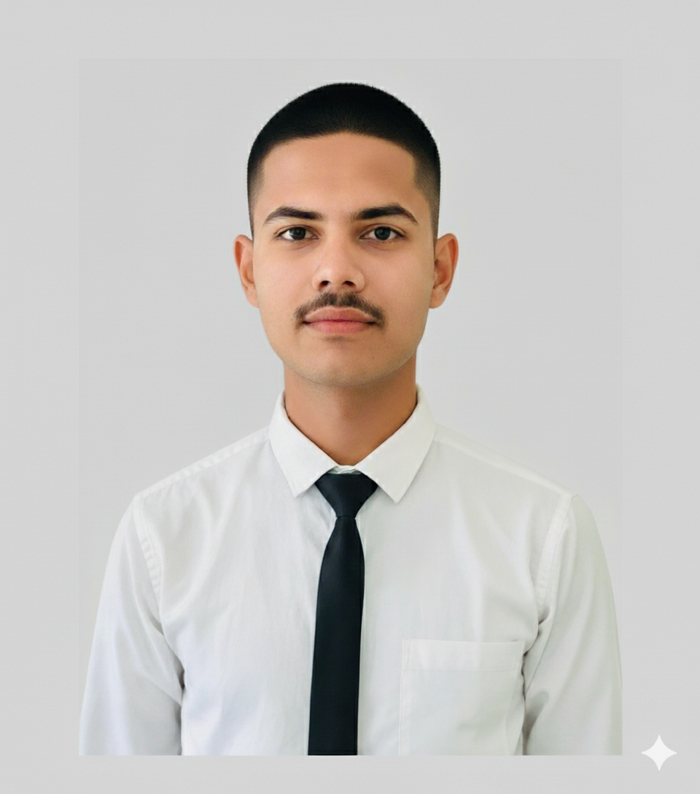

# Hi there, I'm Yash Vardhan Pandey 👋 

I'm a **Full-Stack Developer & Tech Entrepreneur**. I specialize in engineering high-performance digital ecosystems that solve real-world business problems. 

Currently, I am scaling **VardhanFlow**, my first SaaS venture focused on digital orchestration for the hospitality industry.

 

---

## 🚀 My 1st Business: VardhanFlow
**VardhanFlow** is an enterprise-grade orchestration platform designed to bridge the gap between local businesses and digital efficiency. 

* **Flagship Product:** Smart QR Menu SaaS for high-end hospitality.
* **Tech Stack:** Next.js, Tailwind CSS, Vercel Orchestration.
* **Business Model:** Milestone-based (60/40) professional deployment.
* **Status:** Operational & Live.

🔗 **Official Domain:** [www.vardhanflow.com](http://www.vardhanflow.com) 
🔗 **Live Engineering Preview:** [VardhanFlow Live](https://vardhan-flow-website.vercel.app/)

---

### 🛠️ My Tech Stack

---

### 📂 Engineering Projects

| Project Name | Description | Links |
|---|---|---|
| **SentinelFace** | Biometric attendance terminal with EAR liveness detection & GPS geofencing. | <a href="https://face-attendance-frontend-weld.vercel.app">Demo</a> |
| **Vardhan's Wear** | Full-stack MERN e-commerce PWA with Razorpay integration. | <a href="https://vardhan-wears.vercel.app">Demo</a> |
| **Neighborly** | Real-time hyperlocal community help app with integrated chat. | <a href="https://neighborly-app-one.vercel.app/">Demo</a> |
| **Neha's Restaurant** | Full-stack restaurant management system with secure reservations. | <a href="https://nehas-restaurant-frontend.vercel.app">Demo</a> |

---

### 📫 Connect with Me

- **Business Inquiries:** [www.vardhanflow.com](http://www.vardhanflow.com)
- **LinkedIn:** [Yash Vardhan Pandey](https://www.linkedin.com/in/yash-pandey-fullstack/)
- **YouTube:** [Engineering Devlogs](https://www.youtube.com/channel/UCS8CRyAxM0zG6hRsVUNhcEw)
- **Portfolio:** [Visit My Digital Portfolio](https://pndeyyash-cmd.github.io/my-portfolio)

---
